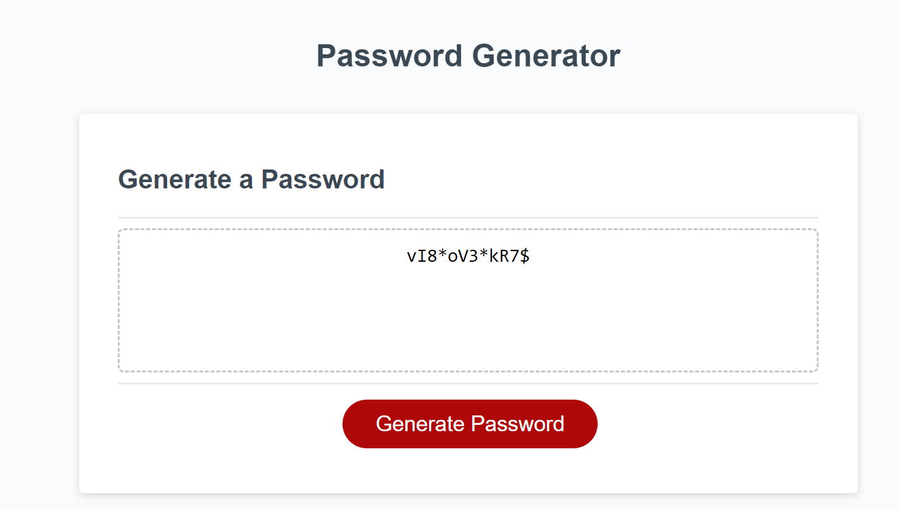
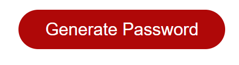
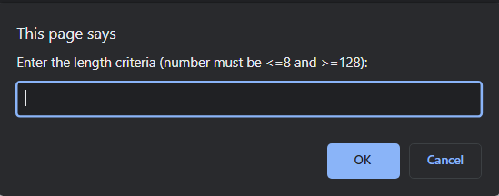
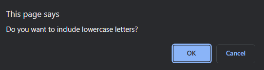
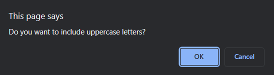
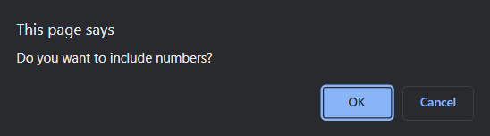
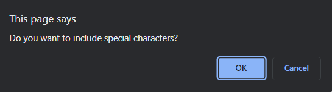
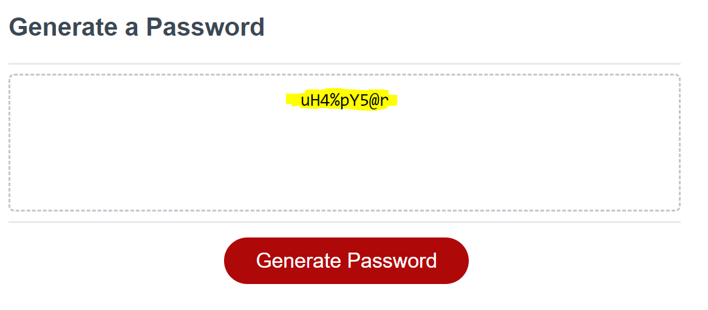

# Password Generator

## Description

The password generator will produce a strong password that adheres to the criteria supplied by the user.

## Table of Contents

- [Installation](#installation)
- [Usage](#usage)
- [License](#license)

## Installation

There are no installation steps needed as the website only uses HTML, CSS, Javascript which is supported in the browser

## Usage

To use the password generator go to: [Password Generator](https://sinthushan.github.io/PasswordGenerator)

or

You can clone the repository using: `git clone git@github.com:sinthushan/PasswordGenerator.git`
Once cloned open up the index.html file in a web browser

### Steps
- click on the Generate password button \
 
- you will be prompted to decide wether you want to choose a specific character length\
 
- if you click cancelled by default the required length will be 8
- if you click ok you will be prompted to input a number between 8 and 128 inclusive (non-numbers and numbers outside the range will cause an alert and the prompt to reemerge)\
 
- you will then be given 4 different to prompts to determine which character sets you wish to use in your password (user must select at least one)\

- your password meeting your criteria will appear in the center panel of the app\
 

## License

MIT License
